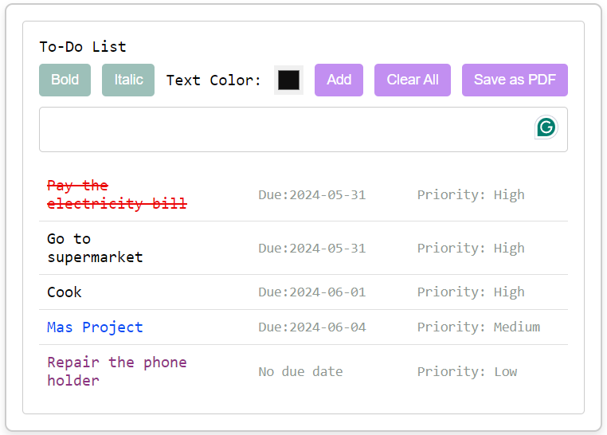

# Web-Component-To-Do-List
A custom web component for the Framework Design Course written in JavaScript

# ToDoList Web Component

The ToDoList web component is a customizable to-do list that can be easily integrated into web applications. It provides features like adding, deleting, and marking tasks as completed, as well as saving the list as a PDF. The list with all the features is below.

## Features

- **Add Tasks**: Click the "Add" button to add new tasks to the list.
- **Delete Tasks**: Click the "Delete" button to remove tasks from the list.
- **Clear list**: Click the "Clear all" button to empty the list.
- **Text format options**: Choose the text style (bold, italic) and the color for the task's text.
- **Mark as Completed**: Click the task text to mark it as completed.
- **Due date**: Set a due date for the task (no due date by default)
- **Priority**: Set a priority for the task (by default is high).
- **Drag and drop**: Drag and drop the tasks to rearrange them.
- **Save as PDF**: Click the "Save as PDF" button to download the list as a PDF file.
- **Persistency**: The list remains saved on browser refresh

## Usage

### Installation

You can use the ToDoList web component by including the JavaScript file and css file in your HTML page.

1. Clone the repository or download the source code.
2. Copy the `ToDoComponent` module into your project directory.

### Usage

1. Include the ToDoList custom element in your HTML page:

    ```html
    <!DOCTYPE html>
    <html lang="en">
    <head>
        <meta charset="UTF-8">
        <meta name="viewport" content="width=device-width, initial-scale=1.0">
        <title>My ToDo App</title>
         <!-- Include the script for pdf tool -->
        <script src="https://cdnjs.cloudflare.com/ajax/libs/jspdf/2.4.0/jspdf.umd.min.js"></script>
        <!-- Include ToDoList component -->
        <script type="module" src="ToDoComponent/to-do-list.js"></script>
    </head>
    <body>
        <!-- Use the ToDoList component -->
        <to-do-list></to-do-list>
    </body>
    </html>
    ```

    Note: Pay attention to the src path of the ToDoComponent. It should be reached according to where the html file is. Modify the path to fit your project structure.

2. You could customize the appearance of the ToDoList component by modifying the `styles.css` file.
3. You can modify the size of the component with `size` attribute:
4. ```<to-do-list size="700px,600px"></to-do-list>```

## Implementation Details

The ToDoList web component is implemented by extending the HTMLElement class, which allows for the creation of reusable custom HTML elements with encapsulated functionality and styling.

- **Web Components API**: The component is built using the Web Components API, see `CustomElementRegistry.define()` method to define the custom element.

- **Shadow DOM**: Shadow DOM is utilized to encapsulate the component's styles and prevent them from leaking out and affecting the styles of the parent document or other components.

- **localStorage**: The `localStorage` API is used to store and retrieve the to-do list data locally in the user's browser, allowing tasks to persist across sessions.

- **jsPDF**: The `jsPDF` library is used to generate and save the to-do list as a PDF file. This library enables the creation of PDF documents directly in the browser.
  

### Dependencies

- No external dependencies are required to use the ToDoList web component apart from the pdf tool script that need to be added to the html file.

#### Supported browsers 
Chrome, Chrome Android, Edge, Firefox, IE 5.5, Opera 8, Safari 1.3, Safari iOS
